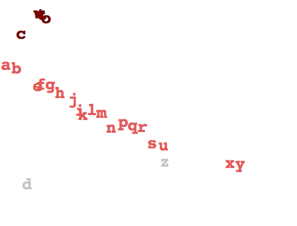

# ui.js
Modern, concise, developer-friendly &amp; zero-config DSL for creating user interfaces.

# Philosophy and Zen of <b style="color:#42a425">ui.js</b>

- **Develop faster**. No dev server, no bundler, no toolchain, no bootstrap template. Starts up in 0 ms 🔥
- Declare new components right inside HTML. Try any ideas right now! 🤘
- No need for any other dependencies for building UI
- Use blazing fast virtual DOM over native Web Components
- True reactive 2-ways state exchange between components
- Concise syntax as close to HTML/CSS/JavaScript as possible
- Less superfluous language constructions to solve common tasks
- Unleash the power of WASM in JavaScript manner

**ui.js** aims to provide a tool for development and application architecture out of the box.

It empowers an effortless creation of highly scalable and easily maintainable applications without Babel transpiler, Parcel, Webpack and any complicated toolchain.

[Try](https://ui.js.org)
